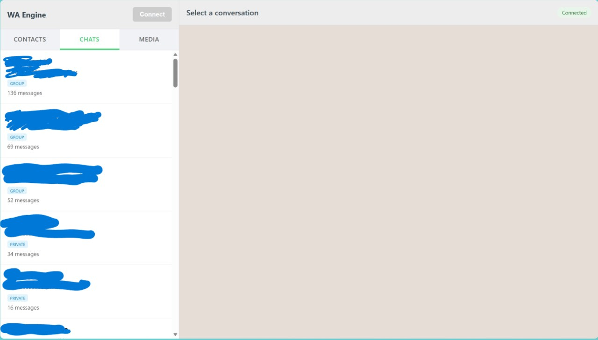
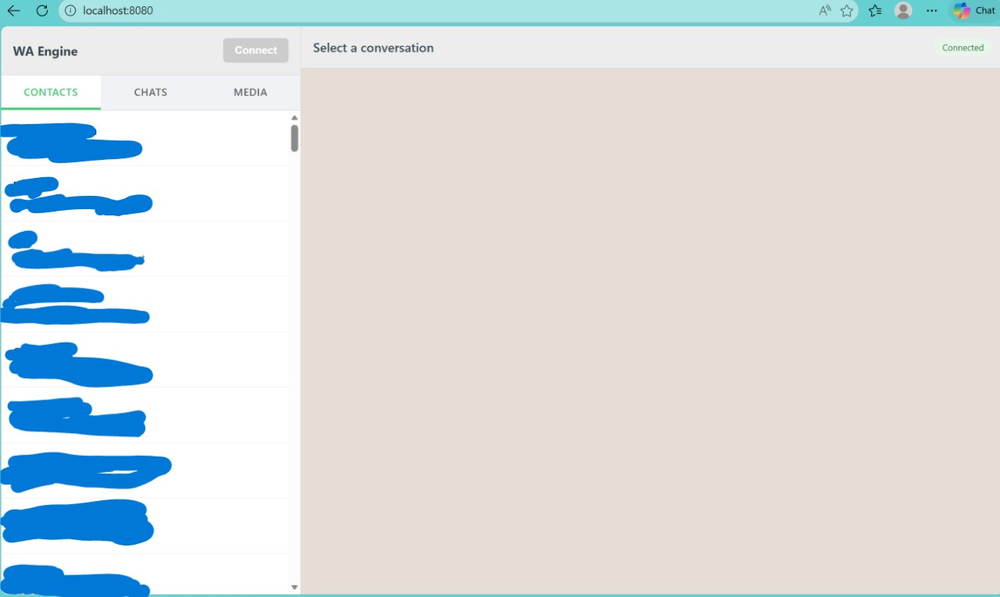
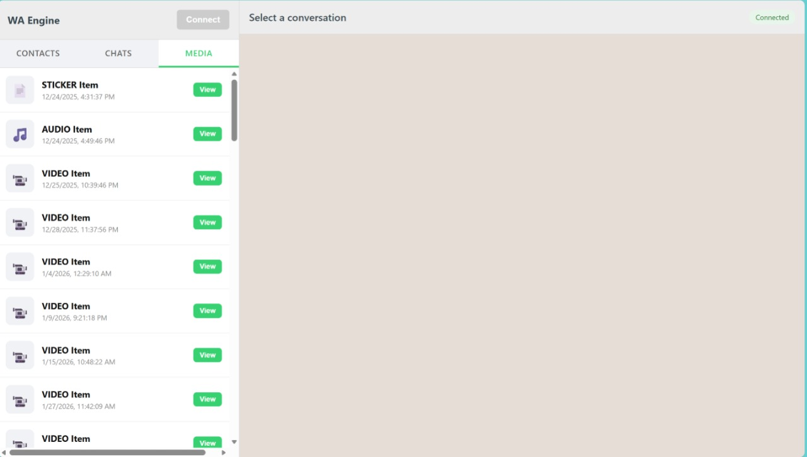

# WhatsApp Cross-Platform Engine: Deployment Guide

This guide describes how to deploy and use the cross-platform WhatsApp engine. The engine shares a core Go codebase (`pkg/shared`) across all platforms.

---

## 🏗️ Architecture Overview

The engine uses a **"Write Once, Run Everywhere"** approach:
*   **Core Logic**: All event handling, caching, and state persistence live in `pkg/shared`.
*   **WASM Bridge**: Connects the Go core to JavaScript for Web and Mobile (via WebView).

---

## 🌐 Option 1: Use for WASM (Web / Mobile / iOS / Android)
*Main focus for the current pull request*

This option compiles the Go engine into WebAssembly, allowing it to run in any browser or inside a **WebView** on mobile devices.

### 1. Build the WASM Package
The build script compiles the code and generates optimized Gzip assets.
```bash
./build.sh wasm
```
**Output**: Everything you need is generated in the `deploy/wasm/` directory.

### 2. Run Locally for Testing
You can serve the WASM files using a simple Python server:
```bash
cd deploy/wasm && python3 -m http.server 8080
```
Open **`http://localhost:8080`** in your browser to interact with the UI.

### 3. Deployment Flow (Web/Mobile)
1.  **Host the Assets**: Upload the `deploy/wasm` folder to your web server or embed it into your Mobile App's assets.
2.  **Initialize**: The `index.html` loads `main.wasm.gz` and initializes the Go bridge.
3.  **Scan QR**: Click "Connect" in the UI to generate a QR code and scan it with your phone.
    
4.  **Sync & Browse**: The WASM engine handles history sync in the background and populates the UI tabs:
    *   **Chats**: View and search your recent conversations.
        
    *   **Contacts**: Browse your synced contact list.
        
    *   **Media**: Access metadata for shared images, videos, and documents.
        

---

## 💻 Option 2: Use from CLI (Native PC)
For power users who want to interact with WhatsApp directly from the terminal with no external dependencies.

### 1. Build the CLI Binary
```bash
./build.sh pc
```
**Output**: A standalone binary at `deploy/cli/whatsapp_cli`.

### 2. Full Usage Flow

#### A. Initial Login & Sync
Generate a QR code and wait for the initial history sync to complete. This creates a persistent state.
```bash
cd deploy/cli
./whatsapp_cli login
```
*Wait for "History Sync Complete" before closing.*

#### B. List Active Chats
View all synchronized conversations and their message counts.
```bash
./whatsapp_cli chats
```

#### C. View Contacts
List all contacts stored in your WhatsApp account.
```bash
./whatsapp_cli contacts
```

#### D. Read Messages
Read the message history for a specific chat using its JID.
```bash
./whatsapp_cli messages [JID]
```

#### E. Browse Media
List metadata for all images, videos, and documents found in your history.
```bash
./whatsapp_cli media
```

#### F. Logout & Cleanup
Terminate the session and wipe all local database and cache files.
```bash
./whatsapp_cli logout
```

---
